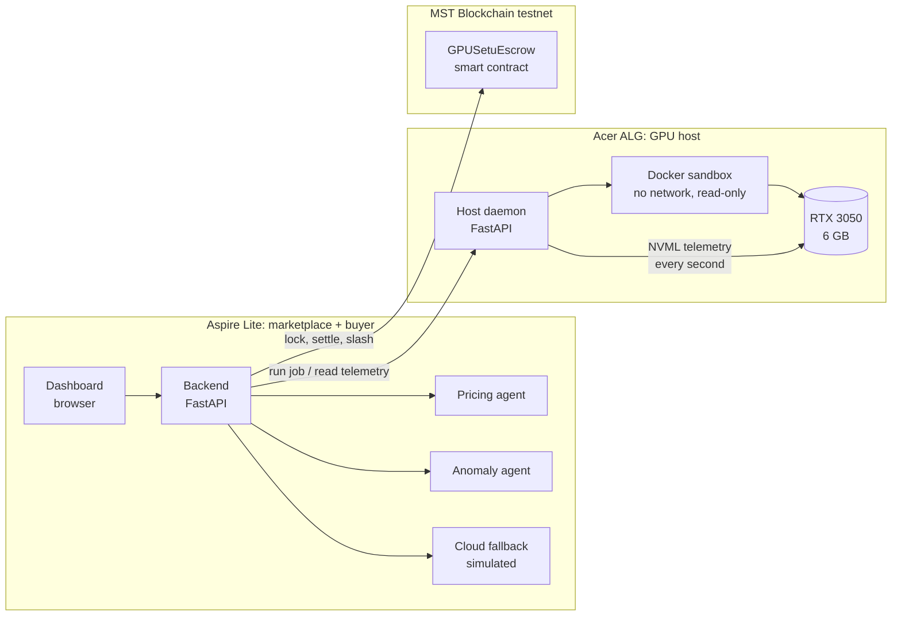

# NAMMAGPU

**Pay only for GPU seconds that did real work.**

NAMMAGPU is a peer-to-peer GPU marketplace for Indian students. Idle campus and gaming-café GPUs rent out compute by the second. Every second is measured directly from the graphics card, payment is locked in escrow on **MST Blockchain** before the job starts, and hosts who fake work lose their security deposit.

Built as a working prototype on two real laptops: an **Acer ALG with an RTX 3050 (6 GB)** as the GPU host, and an **Acer Aspire Lite** as the marketplace and buyer.

---

## The problem

- National AI compute exists, but it is gated. India's IndiaAI compute portal is aimed at researchers and registered startups, not undergraduates with a final-year project.
- Global GPU marketplaces are cheap, but they are priced in USD, need card payments, and give the buyer no independent proof of what they were billed for.
- Meanwhile, consumer and lab GPUs sit idle for most of the day.

The missing piece is **trust**: a stranger renting your GPU needs to know they will be paid, and a buyer needs to know they were billed only for real work.

## What GPUSetu does

| Step | What happens | Who enforces it |
|---|---|---|
| 1. **Price** | A pricing agent quotes a per-second price from recent demand | Marketplace backend |
| 2. **Match** | The job goes to the first idle, staked peer host, or to cloud fallback | Marketplace backend |
| 3. **Escrow** | The buyer's payment is locked on MST testnet **before** the GPU starts | Smart contract |
| 4. **Run** | The job runs inside a sealed Docker sandbox on the host GPU | Host daemon + Docker |
| 5. **Meter** | GPU utilization is read from the hardware (NVML) every second | Host daemon |
| 6. **Audit** | An anomaly agent compares the host's claim with the telemetry | Marketplace backend |
| 7. **Settle or slash** | Honest: host paid for verified seconds, buyer refunded the rest. Cheating: buyer refunded **plus** the host's deposit | Smart contract |

## Results from the live prototype

| Measurement | Result |
|---|---|
| Honest training job | ~31 verified GPU seconds out of ~34–47 s on host; startup never billed |
| Model trained | Small CNN on MNIST, **~99% test accuracy** on 10,000 unseen images |
| Sandbox cost | ~5% slower inside Docker (1,095 vs 1,157 training steps in 30 s) |
| Sandbox isolation | Network access from inside a job fails (`Temporary failure in name resolution`) |
| Fraud demo | Fake job claims ~31 s, telemetry shows 0 s → host slashed, buyer compensated |
| On-chain settlement | Host paid exactly `verified seconds × booked rate`; verified against wallet balances |
| Surge pricing | 30 s × 0.00125 = 0.0375 tMSTC, price locked at booking time |

Smart contract (MST testnet, chain ID 91562037): `0xfAAA422B0057cB2aE33Bf3F356003CA762583816`

---

## Architecture



## Repository layout

```
gpusetu-host/                 runs on the GPU host (Acer ALG)
├── host_daemon.py            job runner, NVML telemetry, Docker sandbox
├── jobs/
│   ├── demo_job.py           real workload: CNN training on MNIST (~30 s)
│   └── fake_job.py           fraud demo: pretends to train, GPU stays idle
└── test_from_buyer.py        quick end-to-end test from another machine

gpusetu-market/               runs on the marketplace (Aspire Lite)
├── backend.py                matching, billing, pricing + anomaly agents, fallback
├── chain.py                  signs and sends transactions to MST
├── setup_chain.py            check / deploy / register-host / status
├── chain_config.example.json template (real config holds test keys, never commit it)
├── contracts/
│   ├── GPUSetuEscrow.sol     the escrow contract
│   └── GPUSetuEscrow.json    compiled ABI + bytecode (solc 0.8.24, EVM "paris")
└── static/dashboard.html     live dashboard, works fully offline
```

---

## How the key pieces work

### Metering (host daemon)
Every second, the daemon reads GPU utilization, memory and temperature from NVIDIA's NVML library. A second counts as **verified** only if utilization is at least 20%. Laptop GPUs power down when idle; the daemon reports that as `sleeping` (counted as 0%) instead of crashing.

### Escrow contract (`GPUSetuEscrow.sol`)
| Function | Who calls it | What it does |
|---|---|---|
| `registerHost()` | Host | Locks a security deposit (minimum 0.2 tMSTC) |
| `lockPayment(jobId, host)` | Buyer | Locks payment before the job; stores the price at booking time |
| `settle(jobId, verifiedSeconds)` | Operator | Pays `verifiedSeconds × rate` to the host, refunds the rest |
| `slash(jobId, reason)` | Operator | Refunds the buyer and gives them the host's whole deposit |
| `refundExpired(jobId)` | Anyone | Full refund if a job is never settled within 1 hour |
| `setRate(rate)` | Operator | Pricing agent changes the price for **future** bookings |

Safety checks tested on a local chain: only the operator can settle, slash or change price; a job settles exactly once; a host cannot withdraw its deposit mid-job; payment can never exceed the locked amount.

### Anomaly agent (fraud detection)
Each host submits a **claim** ("my GPU worked for the whole job"). The agent compares it with the telemetry:

- Telemetry backs **at least 50%** of the claim → honest. Only verified seconds are paid; slow startup costs the host, not the buyer.
- Telemetry backs **less than 50%** → fraud → slash.

The rule is deliberately conservative because a slash on-chain cannot be undone. An earlier, stricter rule produced a false positive when Docker startup took 13 s; this rule was designed to prevent exactly that.

### Pricing agent
Rule-based surge pricing from job requests in the last 10 minutes: 0–2 → 1.0×, 3–5 → 1.25×, 6+ → 1.5× (capped). Every job keeps the price from when it was booked.

### Cloud fallback
If no honest peer host is available (busy, offline, suspended, or its deposit cannot be checked), the job goes to a **simulated** Vast.ai-style provider. The receipt shows provider cost and marketplace margin. The dashboard tracks the share of jobs served by peers, which should rise as more hosts join.

### Sandbox
Jobs run in `pytorch/pytorch:2.6.0-cuda12.4-cudnn9-runtime` with: GPU access, **no network**, read-only filesystem and job files, a non-root user, all Linux capabilities dropped, and memory/CPU/process limits. If Docker is unavailable, the daemon says why and falls back to plain processes.

---

## Quick start

### Requirements
- **GPU host:** Windows with an NVIDIA GPU, Python 3.11, PyTorch with CUDA, Docker Desktop (WSL 2) for the sandbox. **Keep it on the charger**: on battery, training ran ~30% slower.
- **Marketplace:** any laptop with Python 3.11.
- Both machines on the same network that allows device-to-device traffic (a phone hotspot works; many campus Wi-Fi networks block it).

### 1. GPU host
```powershell
cd gpusetu-host
pip install fastapi uvicorn nvidia-ml-py numpy pillow
# PyTorch with CUDA: use the command from pytorch.org for your CUDA version
python -c "from torchvision import datasets; datasets.MNIST('jobs/data', train=True, download=True)"
docker pull pytorch/pytorch:2.6.0-cuda12.4-cudnn9-runtime      # optional, for the sandbox
python -m uvicorn host_daemon:app --host 0.0.0.0 --port 8000
```
Check the first line: `Sandbox: ON (...)` or `Sandbox: OFF: <reason>`. Allow port 8000 through Windows Firewall.

### 2. Blockchain (one time)
Create three **test-only** MetaMask accounts (operator, buyer, host), fund them from the MST testnet faucet, then:
```powershell
cd gpusetu-market
pip install fastapi uvicorn web3
copy chain_config.example.json chain_config.json   # paste the three test keys
python setup_chain.py check
python setup_chain.py deploy
python setup_chain.py register-host
python setup_chain.py status
```

### 3. Marketplace
```powershell
$env:HOST_URL = "http://<host-ip>:8000"     # the GPU host's address from ipconfig
python -m uvicorn backend:app --host 0.0.0.0 --port 9000
```
Open `http://127.0.0.1:9000`. Without `chain_config.json` (or with `"enabled": false`), everything runs without the blockchain.

---

## Trust model and honest limitations

| Limitation | Why it's acceptable for a prototype | Roadmap |
|---|---|---|
| The host daemon is trusted to report telemetry honestly | The fraud demo catches a host that fakes the **work**; tampering with the daemon itself is a separate attack | Signed telemetry, attestation, multiple independent verifiers |
| The marketplace acts as the on-chain operator | Keeps the contract simple and cheap | Decentralized verifier set; dispute window before a slash is final |
| Agents are rule-based, not ML | Every price and verdict is explainable | Learn thresholds from real job data |
| Cloud fallback is simulated and off-chain | Proves routing and margin logic | Real Vast.ai / RunPod API integration |
| Buyer wallet is custodial in the demo | Students need no crypto knowledge | Wallet onboarding via MST's SARAL login |
| One host, one demo workload | Enough to prove the full pipeline end to end | Multi-host matching, arbitrary sandboxed jobs, image generation |

## Tech stack
Python 3.11 · FastAPI · PyTorch 2.6 (CUDA 12.4) · NVIDIA NVML · Docker Desktop + WSL 2 · Solidity 0.8.24 · web3.py · MST Blockchain testnet · plain HTML/JS dashboard (no external dependencies)

## Security note
`chain_config.json` holds private keys for **test-only** wallets and is excluded by `.gitignore`. Never reuse these keys or put real funds in them.

## Team
_Add team names and roles here._
